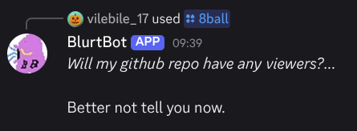
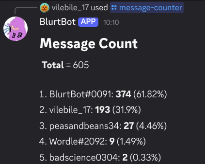

# BlurtBot

BlurtBot is a simple (and useless) discord bot developed for a [boot.dev personal project](https://www.boot.dev/courses/build-personal-project-1).

## Installation

For installing the bot you have two options:

1. Click this [link](https://discord.com/oauth2/authorize?client_id=1415294993320378469&permissions=137439439872&integration_type=0&scope=bot+applications.commands) to add it to your server. I may or may not be hosting the bot right now so there's a good chance that it will be offline ☹️
2. **DOCKER!** - head over to my [docker repo](https://hub.docker.com/repository/docker/vilebile17/blurt_bot/general) and follow the instructions there. It is _so_ much cooler than cloning and running via `uv`.

## Commands

**NOTE that as of right now, the google gemini commands do not work (I've temporarily removed them) as google has severely reduced the number of free tokens you can have. I might (probably won't as we developers _love_ making fake promises) add a different LLM at some point in the future.**

|Command |    description     |
|------|--------       |
|Predict|Uses [google gemini](https://ai.google.dev/) to predict the next message based on the last 20 (it's not very good)|
|Message-Counter|Counts the number of messages that each user sent in a channel. Based on my [first project](https://replit.com/@vilebile17/Skype-message-counter)|
|8ball|Pretty straight forward, gives a magic-eight-ball like response|
|BookBot|Counts the frequency that each character appears at in each channel (eg. how many 't's or 'e's or '💀's)|
|Random-Person|Selects a random person who has access to the channel|
|@BlurtBot|If you @ mention the bot it will use google gemini to offer a response! (You basically have access to Gemini directly in a channel)|

As of right now, there are no prefix commands. (The ones that don't show up in the discord commands section and are _invisible_) *However*, I may (probably won't) add some in the future.

