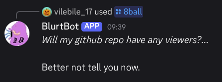

# BlurtBot

BlurtBot is a simple (and useless) discord bot developed for a [boot.dev personal project](https://www.boot.dev/courses/build-personal-project-1).




## Commands
|Command |    description     |
|------|--------       |
|Predict|Uses [google gemini](https://ai.google.dev/) to predict the next message based on the last 20 (it's not very good)|
|Message-Counter|Counts the number of messages that each user sent in a channel. Based on my [first project](https://replit.com/@vilebile17/Skype-message-counter)|
|8ball|Pretty straight forward, gives a magic-eight-ball like response|
|BookBot|Counts the frequency that each character appears at in each channel (eg. how many 't's or 'e's or '💀's)|
|Random-Person|Selects a random person who has access to the channel|

As of right now, there are no prefix commands. (The ones that are invisible and used by power-users) *However*, I may add some in the future.

## Installation
For installing the bot you have two options:
1. Click the [link](https://discord.com/oauth2/authorize?client_id=1415294993320378469&permissions=137439439872&integration_type=0&scope=bot+applications.commands) to invite the bot to your server. The only issue is that I'm **not** cloud hosting the bot (yet) so you will only be able to use the bot when I have it on. (not particularly useful)
2. Self-hosting (where you do loads of work!)
```
git clone https://github.com/vilebile17/BlurtBot
cd BlurtBot
```
You then need to create a .env file in the following format:
```
DISCORD_TOKEN="..."
GEMINI_API_KEY="..."
SERVER_ID="..."
DEFAULT_CHANNEL="..."
```
- The **DISCORD_TOKEN** can be found by navigating to the [discord apps](https://discord.com/developers/applications) page and then creating a new one. Click on it and navigate to the 'Bot' tab. You should see a button that says 'reset token.' That button give you your token as discord will always hide the token for security reasons.
- The **GEMINI_API_KEY** can be found at google's [dev page.](https://aistudio.google.com) Click the 'Create API Key' button and you should have it.
- **SERVER_ID** can be found in discord by right-clicking on the server and clicking 'copy server id' (make sure you have turned developer mode on in settings->advanced settings->developer mode)
- **DEFAULT_CHANNEL** is very similar to SERVER_ID, right-click on a channel to get its ID

Once you have completed all of that you should be good to go!
```
uv run main.py
```
uv should auto-magically install all of the dependencies through the pyproject.toml
